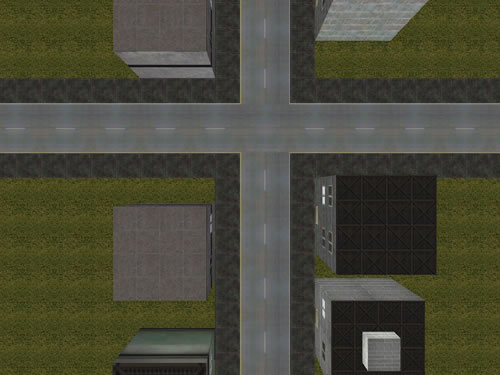

<div align="center">

## Take Lent \(DX7 3D Game like GTA\)


</div>

### Description

It is the begining of a game like GTA totally made in DirectX 7. It's under development and I need some help to complete this project, and I know that some people can help me. First, we need to add the player and I car, second, the camera must to move similar to GTA, and add other stuff.

PLEASE, VOTE FOR ME IF YOU LIKE IT AND LEAVE SOME FEEDBACKS, TELL ME WHAT YOU THINK.

Sorry, I couldn't upload it to PSC, I don't know why. Please download it at: http://planeta.terra.com.br/informatica/fredisoft/downloads/TakeLent.zip

** IMPORTANT ** Do not use any downloader, like GetRight, Gozzila, etc... Turn it off.
 
### More Info
 


<span>             |<span>
---                |---
**Submitted On**   |
**By**             |[Frederico Machado](https://github.com/Planet-Source-Code/PSCIndex/blob/master/ByAuthor/frederico-machado.md)
**Level**          |Beginner
**User Rating**    |5.0 (109 globes from 22 users)
**Compatibility**  |VB 6\.0
**Category**       |[DirectX](https://github.com/Planet-Source-Code/PSCIndex/blob/master/ByCategory/directx__1-44.md)
**World**          |[Visual Basic](https://github.com/Planet-Source-Code/PSCIndex/blob/master/ByWorld/visual-basic.md)
**Archive File**   |[](https://github.com/Planet-Source-Code/frederico-machado-take-lent-dx7-3d-game-like-gta__1-32514/archive/master.zip)


### Source Code

```
PLEASE, VOTE FOR ME IF YOU LIKE IT AND LEAVE SOME FEEDBACKS, TELL ME WHAT YOU THINK.
Sorry, I couldn't upload it to PSC, I don't know why. Please download it at:
http://planeta.terra.com.br/informatica/fredisoft/downloads/TakeLent.zip
** IMPORTANT ** Do not use any downloader, like GetRight, Gozzila, etc... Turn it off.
```

